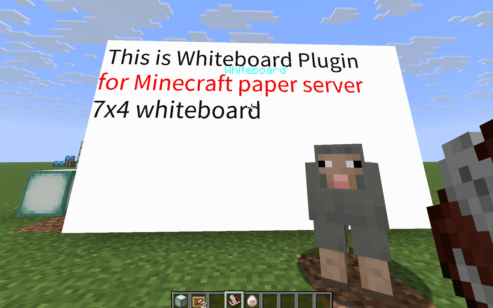

# Whiteboard (Paper plugin)

> Render text from a **writable book** onto an **Item-Frame whiteboard**.
> Supports grid boards, lock, background fill, fonts, undo/redo—server-side only.

## Summary

Whiteboard lets players place a board on item frames and push book text onto it with a right-click. Multiple maps can be merged into a large grid board—handy for PDCA-style planning with kids, without client mods.

## Images



## Requirements

* **Server:** Paper 1.21.9 (or compatible)
* **Java:** 21
* **Client:** Vanilla (no mods needed)

## Install

1. Download the JAR from Releases (or Hangar).
2. Drop it into `plugins/` and start the server.

## Usage

1. Place an **Item Frame** (map inside is recommended).
2. (Optional) Create a grid board:

   ```
   /wb grid 3x2
   ```
3. Write in a **writable book**, hold it, and right-click the board to render.
   * Book directives let you control setup without commands:

     | Directive            | Effect                                                             |
     |---------------------|---------------------------------------------------------------------|
     | `[boardsize WxH]`   | Create/reset a board using the clicked frame as the top-left tile.  |
     | `[lock on/off]`     | Lock (default) or unlock the board after creation/updates.          |
     | `[size N]`          | Override text size (8–64).                                          |
     | `[line N]`          | Set line height when rendering wrapped/global text.                 |
     | `[pos X Y]`         | Offset drawing position. `[xy …]` / `[offset …]` also work.         |
     | `[color #RRGGBB]`   | Change text colour (CSS names or hex).                              |
     | `[clear]`           | Clear existing text before applying the book.                       |

     Example first page:

     ```
     [boardsize 7x4] [lock off] [clear]
     [size 18] [color #ffaa00] Hello Whiteboard!
     ```

### Commands

```
/wb grid <COLS>x<ROWS>     # e.g., /wb grid 3x2
/wb text [<text>]          # no arg: use held book; with arg: draw the text
/wb font size=<n> color=#RRGGBB
/wb bg <#RRGGBB>
/wb lock on|off
/wb clear
/wb undo
/wb redo
```

## Build (dev)

```bash
./gradlew clean build
# JAR: build/libs/Whiteboard-<version>.jar
```

## Localization(i18n)
Language files live in `src/main/resources/lang/`.
If your language isn’t available, please add a new file (e.g. `de_de.yml`) and open a PR.

## Troubleshooting

* **Nothing renders:** check permissions and console; ensure you’re right-clicking while holding a written book.
* **Hangar publish 400 (noColor):** create the channel (e.g., `Snapshot`) on Hangar UI and assign a color, then publish again.

## License

MIT (see `LICENSE`).

## Credit
* [納戸工房 / Closet Workshop](https://donguri3.net/)
